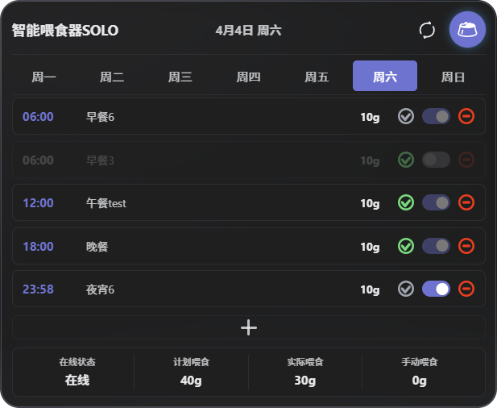

# PetKit Feeder Home Assistant Integration

[](https://github.com/hacs/integration)

English | [简体中文](README.md)

Native Home Assistant integration for PetKit smart feeders.

## Card Preview



## Supported Devices

| Device | Model | Status |
|--------|-------|--------|
| Fresh Element Solo | D4 | ✅ Supported |
| Fresh Element | D3 | 🚧 In Development |
| Fresh Element Duo | D4s | 🚧 In Development |
| Feeder Mini | Mini | 🚧 In Development |

## Features

- **Feeding Schedule Management** - Add/delete/modify schedules, auto-sync weekly
- **Feeding History** - Track every feeding detail
- **Manual Feeding** - One-click feeding
- **Status Monitoring** - Online status, WiFi signal, desiccant status
- **Beautiful Card** - Custom Lovelace card for visualization

## Installation

### HACS Installation (Recommended)

1. HACS → Integrations → Explore and download repositories
2. Search for "Petkit Feeder"
3. Click download and restart Home Assistant
4. Settings → Devices & Services → Add Integration → Search for "Petkit"

### Manual Installation

1. Copy `custom_components/petkit_feeder` to your Home Assistant `custom_components` directory
2. Copy `petkit_feeder_card/dist/petkit-feeder-card.js` to your `www` directory
3. Restart Home Assistant
4. Settings → Devices & Services → Add Integration → Search for "Petkit"

## Lovelace Card

```yaml
type: custom:petkit-feeder-card
device_id: "276669"
```

## Credits

This project is based on [py-petkit-api](https://github.com/Jezza34000/py-petkit-api). Thanks to the original author.

## Disclaimer

- This is not an official PetKit product
- API may change at any time